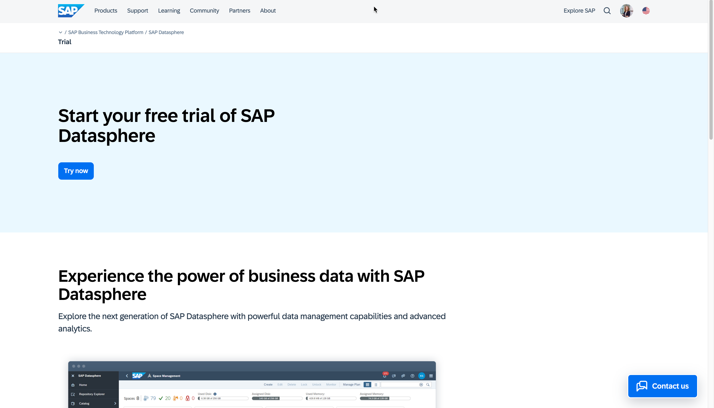
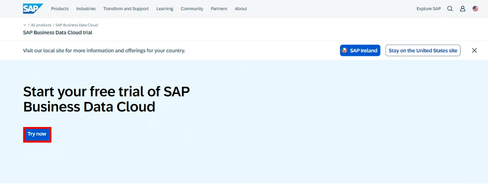
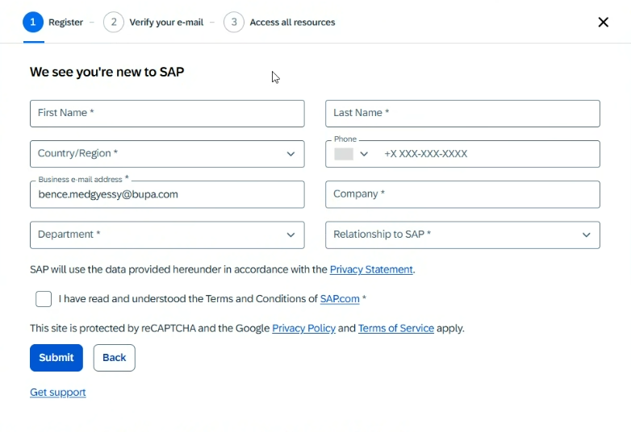
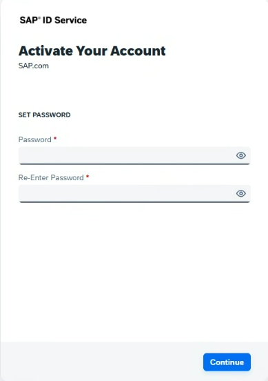
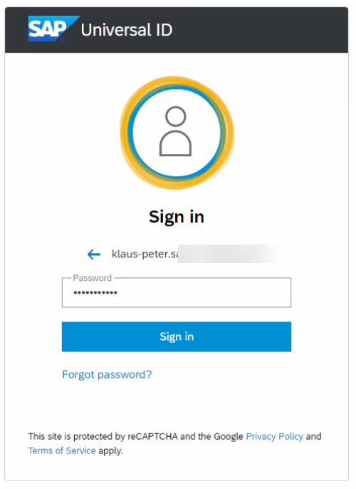
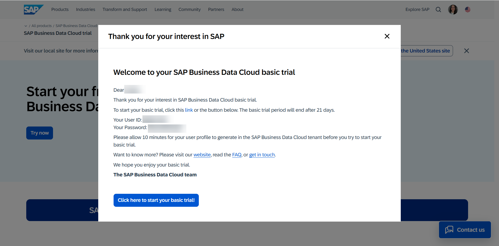
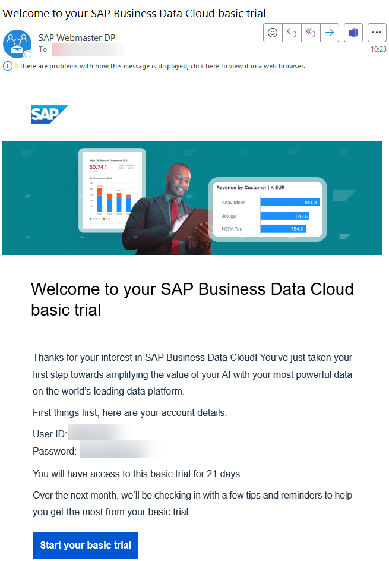
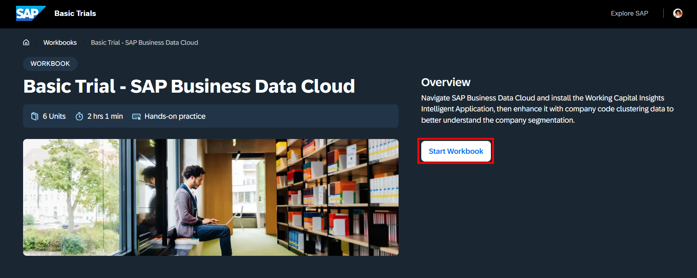
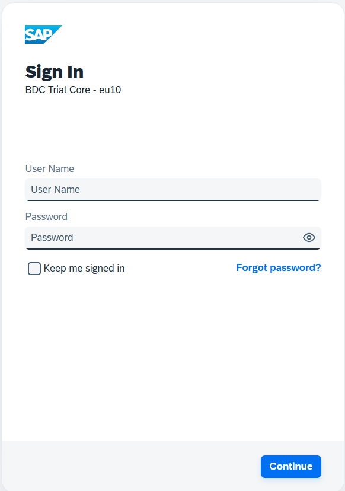
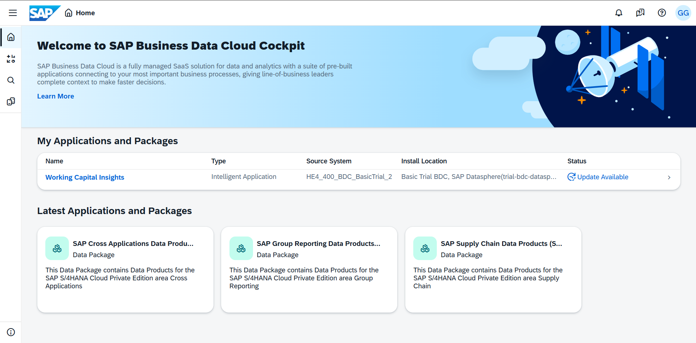

# Get your basic trial access 

First you need to get your basic trial access of SAP Datasphere (mandatory). You could use any SAP Datasphere system you have access to, as all the required files for the core exercises are provided as part of this GitHub repository. 

1.	Navigate to the SAP Datasphere product page on sap.com for the [basic trial](https://www.sap.com/products/data-cloud/trial.html)
   

2.  Click ***Try now*** or alternatively use the follwing link  https://www.sap.com/products/data-cloud/trial.html
 

3.  The registration form will show up. Please provide your email address and proceed using the ***NEXT*** button.  

---

> :bulb: Tip: If you are new to SAP, proceed with providing the required information in the form. 

---

 

4.  You then get an email to finalize the activation of your account. Activate your account by clicking on the button ***CLICK TO ACTIVATE YOUR ACCOUNT***
 
  
    Enter a password and click ***SUBMIT***.
 
  
5.  In case you already have a universal ID, you are asked to provide your existing password.
 

6.  Now your login details (user ID and password) are shown to you. 
 

    You will also get an email with the same information.
 

7.  Once you click on Start your basic trial, you will be navigated to the following page. Click on ***Start Workbook***
 

    You will get a brief introduction of SAP Business Data Cloud and its architecture, you can go through it and once done click on ***Continue*** to navigate to Log on to Business Data Cloud page.

8.  In this page, you will get an idea about the objectives along with the persona involved and if you continue reading you will be presented with the tenant link that will navigate you to SAP Business Data Cloud trial.
 

9.  You can login to your guided experience trial tenant using the login details and the URL you have received.
 

10.  After a successful login you get to the welcome screen.
 

## Summary

Now that you have a guided experience trial system available, let's get started with the hands-on exercises.

Continue with [Your First Log On](../ex00/README_FirstLogon.md)
