# Exercise 1: Getting Started with Business Data Cloud Cockpit and your SAP Datasphere Space

> :memo: **Note:** This is an optional exercise.

---

## :beginner: Detour: SAP Business Data Cloud Cockpit 

**Business Data Cloud Cockpit**: It is one of the core components of the SAP Business Data Cloud solution. SAP Business Data Cloud cockpit can be used to display and configure the SAP Business Data Cloud landscape and managing users and roles or to discover data products and intelligent applications, depending on the persona of the end-users.

**Catalog and Marketplace**: The catalog unifies your organization’s data, providing a seamless one-stop-shop experience. It enables a complete and connected view of all data sources, build and apply governance standards, and offers trusted, self-service data discovery for all users.

**Data product**: A data product is a dataset that contains both the raw business data and its metadata. The metadata includes interface definitions for data extraction, delta-load capabilities, and documentation describing the data product. It is self-describing enabling easy discovery and seamless consumption by any analytical application.

**Intelligent Application**: Intelligent Applications are premium solutions in SAP Business Data Cloud that streamline data analytics from observation to action. They offer comprehensive dashboards, facilitate data analysis, and suggest viable actions while leveraging AI when applicable.

## End of Detour
 

## Getting Started with Business Data Cloud Cockpit

---

> :boom: **Important:** :boom:  
> In case you are not using a guided experience trial system for this hands-on training, then you require a space on the SAP Datasphere tenant you are using. 

---
1. In Business Data Cloud Cockpit, navigate to the tab Intelligent Application and Data Packages
 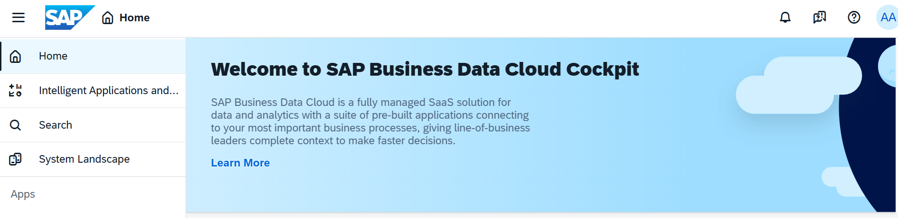

2. Navigate to Installed tab, to see the Installed Intelligent Application. For our case, the Intelligent Application installed is Working Capital Insights, click on it to navigate to the documentation and further details related to it.
 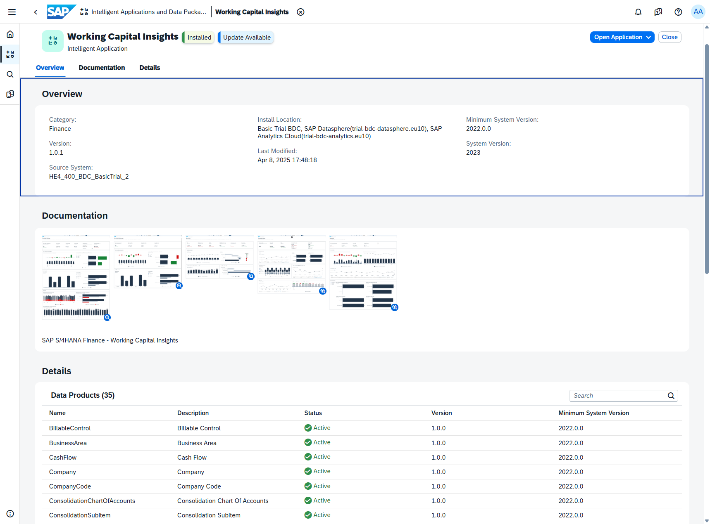

3. If you click on Open Application on the right corner, you will be navigated directly to the Intelligent Application in SAP Analytics Cloud tenant
 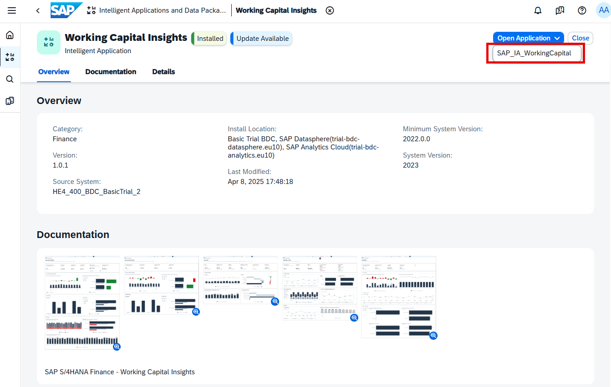

4. The Intelligent Application in SAP Analytics Cloud is illustrated below
 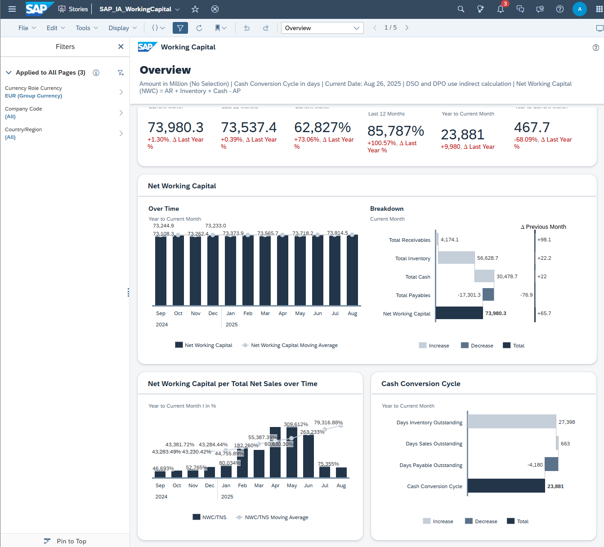

5. Going back to our Business Data Cloud tenant, in the same tab for Working Capital Intelligent Application, scroll down to Content Section. Here you can see URLs that will allow you to navigate directly to the folder location of the Intelligent Application in SAP Analytics Cloud, along with the 3 Spaces in SAP Datasphere where you can find the Data Packages associated to Working Capital Insights.
 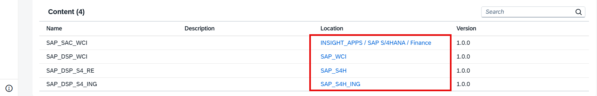

6. Click on the first space URL SAP_WCI. You will be navigated to the Space Properties in SAP Datasphere
 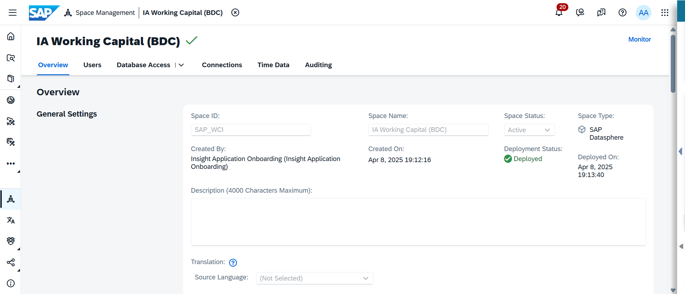

## :beginner: Detour: SAP Datasphere - Spaces

Spaces as part of the SAP Datasphere solution are virtual team environments where your administrator has the ability to assign users and roles, as well as additional resources, connections to data sources, and allocated storage.  
In SAP Datasphere all data related workflows start with the selection of a space, so you can see the space is a fundamental concept. Users can share tables and view to another space to allow users assigned to that space to use it as a source for their objects.

## End of Detour
 

8. Alternatively, if you would like to check the different spaces available for you in the tenant, in the menu on the left-hand side, select the option ***Space Management***.
 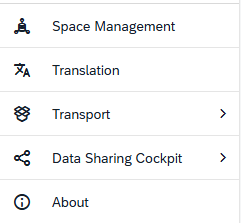

9. After you selected the menu item, you will be presented with a list of existing spaces, including the one highlighted in SAP Business Data Cloud.
 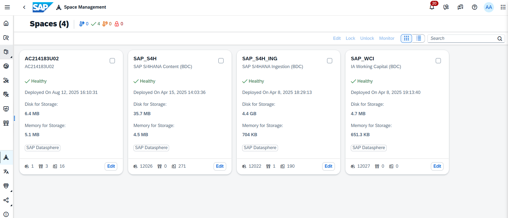

10. Click the ***EDIT*** button of your assigned space. 
The pre-defined spaces are usually named the same way as your user ID for example GE12345. The technical ID is identical to the space name. 
 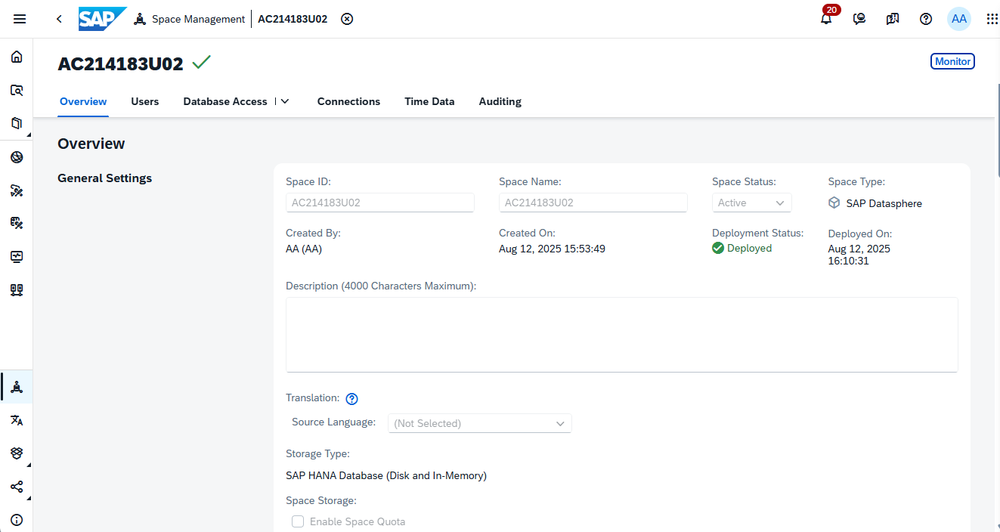

11. You are now being presented with the properties of your space and the abilities to configure certain options.  Changing the storage assignment or workload management options is not possible in basic trial systems. 

12. In the "Users" section you can see that your user (e.g. AC123456) is already assigned to the Space.
 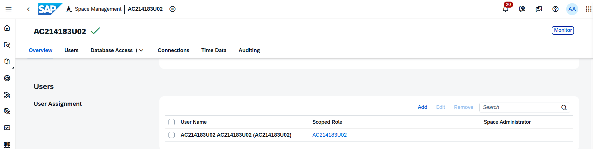

13. The **Time Data** section shows that time table and dimensions have already been created in your space. They provide standardized time data which we will use later as part of our model to create a date hierarchy. If you are using an own Datasphere tenant, please create the Time Tables and Dimensions.
 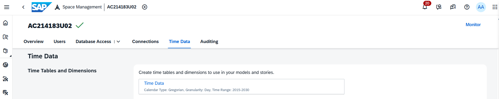

## Summary

You have explored the settings of your space in SAP Datasphere. You can now start your next step and create your first data model.

Continue to - [Exercise 4: Importing Tables](../ex04/README.md) or [Exercise 02: Prepare Your Data (optional) ](../ex02/README.md) 
