# Exercise 8 - Top 10 Revenue Generating Products

In this exercise, we will create a story in SAP Analytics Cloud (SAC), which allows us to analyze and identify the top 10 revenue generating products.

1. Log On to your SAP Analytics Cloud tenant.
    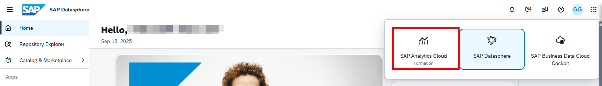 

---

>:bulb: **Note:** The system might prompt you to sign in again. Use the same username and password for SAC as you do for Datasphere.

---

2. Select the menu ***Stories*** in the left-hand panel.

3. Select the option ***Canvas*** to create a new story.

    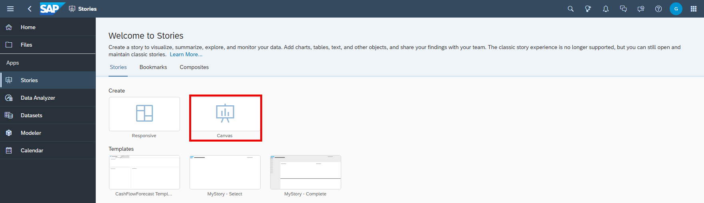 

4. Select a Chart from the available list of widget for it to populate on the canvas
5. To select the model that you want to reference in your story:
    - Select `Datasphere` as the connection on the left panel.
    - Select your space, e.g., `GE123456`, and the folder `TECHED2025-DA264`.
    - For our first example, select your `Sales - Analytic Model`.

    

6. Navigate to the ***Builder*** panel on the right-hand side.

    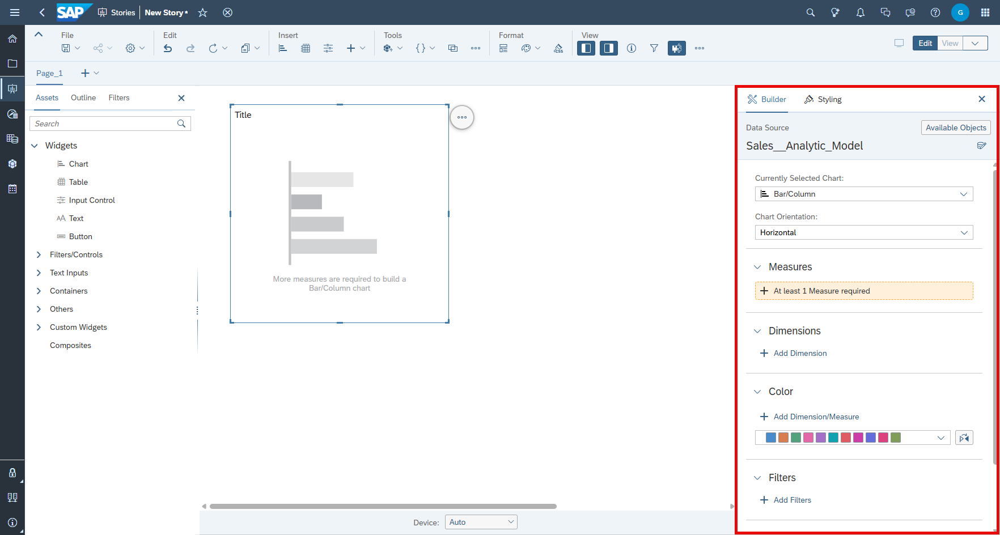 

7. Click ***Add Dimension*** as part of the Dimensions section.

    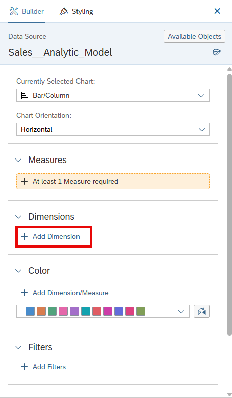 

8. Select ***Transaction Date*** and ***Product ID***. Afterwards, click anywhere outside the view for dimensions selection to return to the chart settings.

    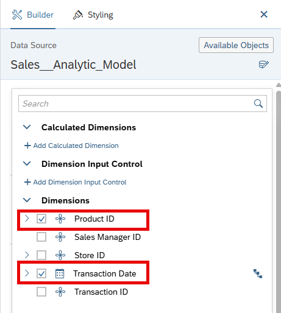

>:bulb: Ensure the ***Transaction Date*** is positioned first within the dimensions section overview.  

9. Add a measure by clicking on the ***At least 1 Measure required*** section.

10. Select the measure ***Revenue***. Afterwards, click anywhere outside the view for measure selection to return to the chart settings.

    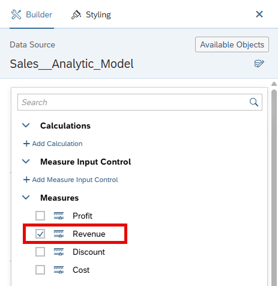

11. Click on the Filter icon for the dimension ***Transaction Date***.

    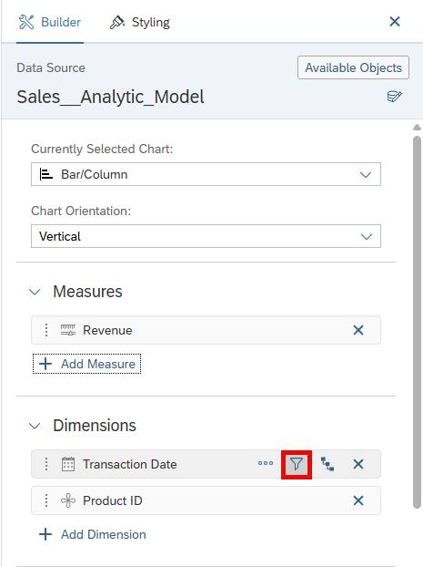 

12. Select the option ***Filter by Member***.

    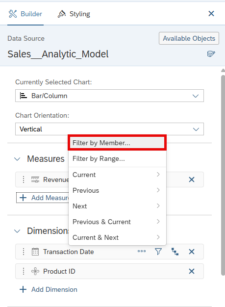 

13. Open the list of members and select the year `2024`. Click ***OK***.

    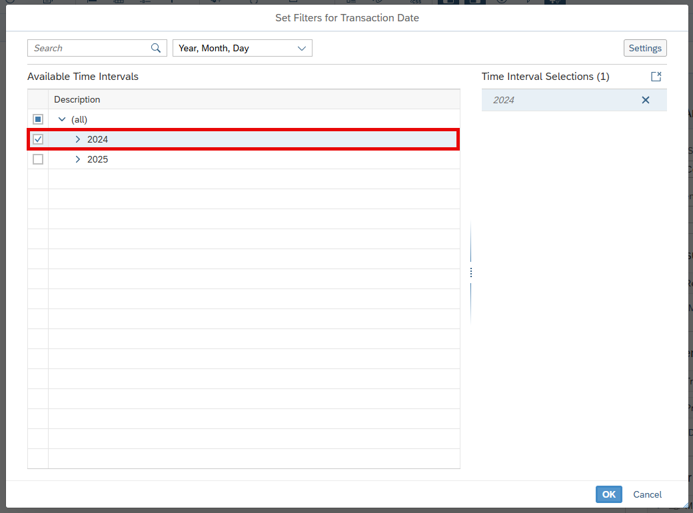

14. Open the ***More Actions*** menu (***...***) for the chart (top right corner of chart). Within the menu, go to ***Rank*** > ***Top N Options*** > Update value to `10`. Click ***Apply***.

    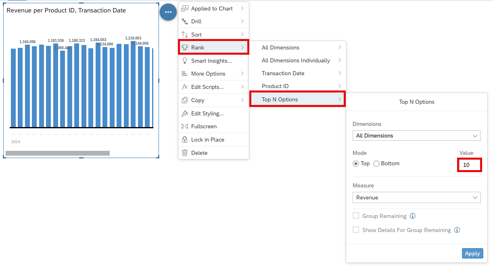

15. Update Chart Orientation to ***Horizontal*** in the Builder Panel.

    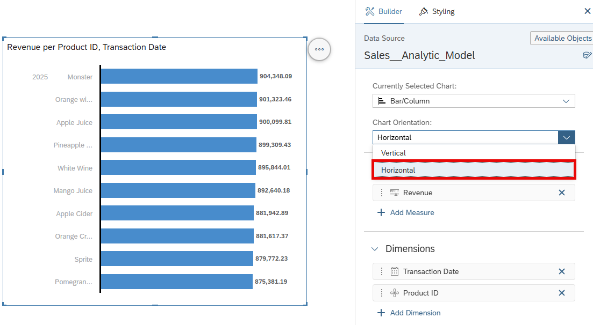

16. You can adjust the size of the chart by clicking and dragging the brackets outward or inward. Additionally, you can move the y-axis to ensure the full product name is displayed.

    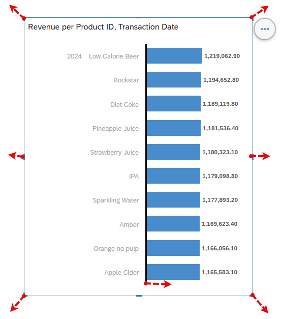

17. Your chart should look like this. Note that only the description of the product is displayed, based on the configuration in ***Display Options*** for ***Product ID***.

    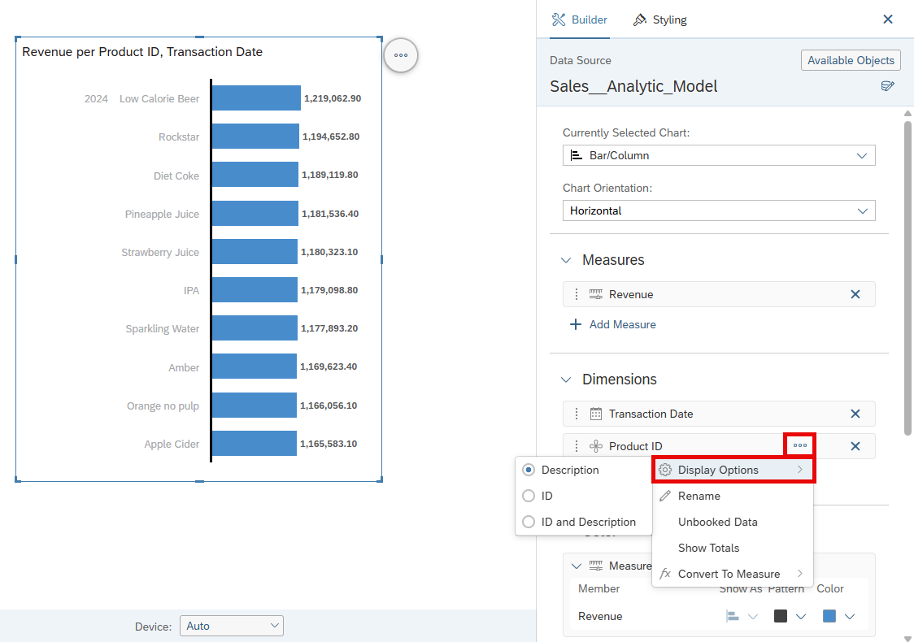 

18. We want to visualize the change in revenue over time using an additional chart. Drag a new chart onto the canvas to get started.

    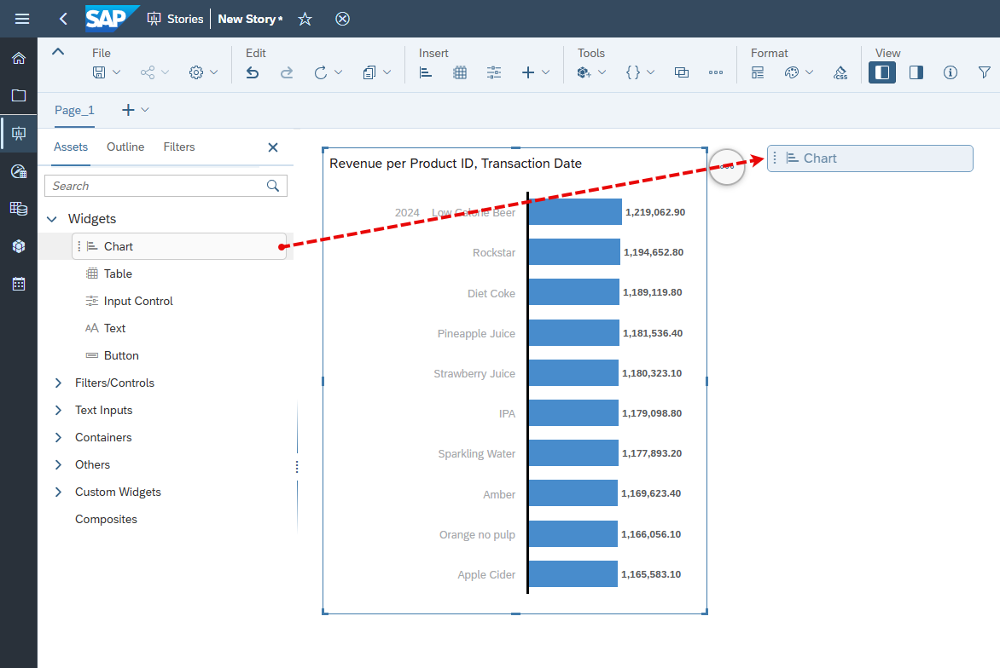 

19. Set the following settings:
    - Select ***Line*** as Currently Selected Chart.
    - The measure for ***Left Y-Axis*** is ***Revenue***.
    - Select ***Transaction Date*** as ***Dimension***.
    - Filter ***Product Category ID (Member)*** to ***Juices***.

    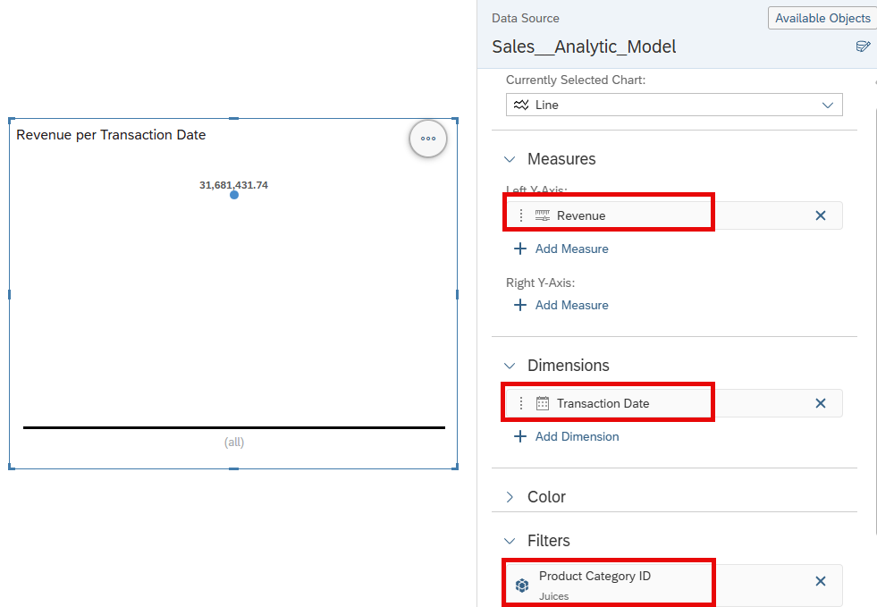 

20. Use the time hierarchy defined for ***Transaction Date*** to perform a quarter-based analysis. Set the hierarchy to ***Year, Quarter, Month, Day*** by clicking on ***Change Hierarchy***. Adjust the level to ***Level 3*** so that the revenue is displayed per quarter.

    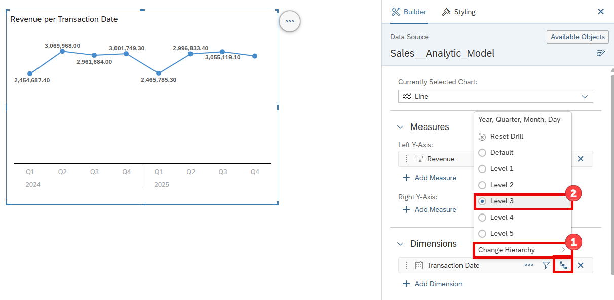 

21. You can now modify the style of your story and add elements, headings, or adjust chart titles. If you select ***+*** (***Insert*** section), you will see options to insert standard shapes or other entities, such as dynamic text.

    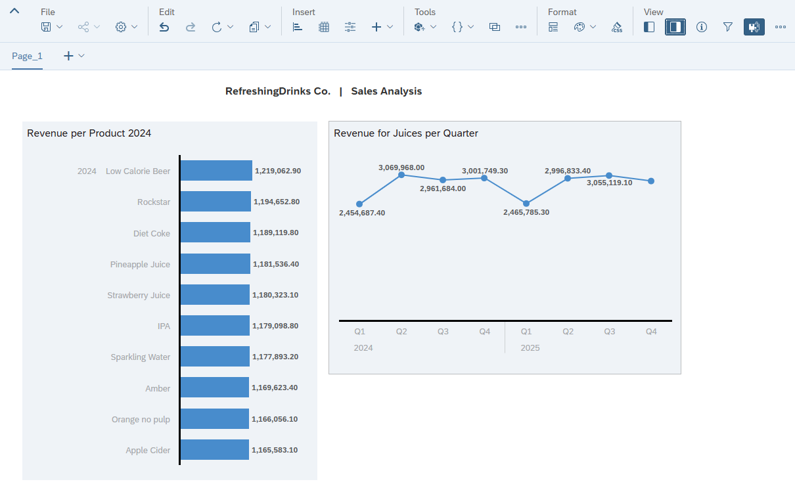 

22. In the ***File*** menu, select the option ***Save*** to save your story.

23. Create a folder that matches your space name, e.g., ***GE123456***.

    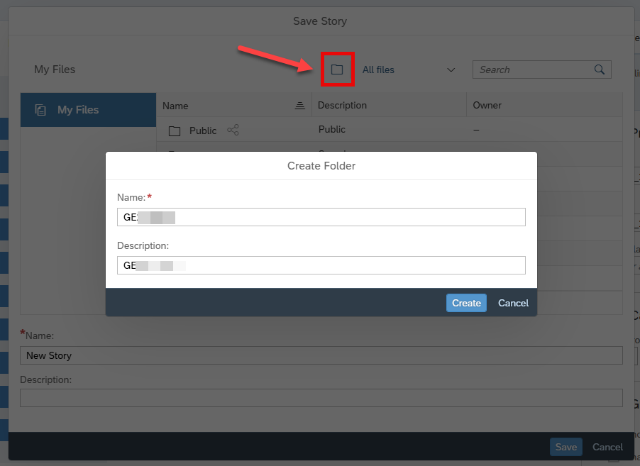

24. Select the folder ***GE123456***. Enter a name and a description, such as ***Revenue Analysis - Products***.

25. Click ***OK***.

## Summary

You've now created your first SAP Analytics Cloud story based on the data model you built earlier.

Continue to - [Exercise 09: Revenue by Geography ](../ex09/README.md)
