# Exercise 9 - Geographic Revenue Distribution

In this exercise, we will set up a story in SAP Analytics Cloud that allows us to visualize the measures on a geographic map.

1. Log On to your SAP Analytics Cloud tenant.

    

---

>:bulb: **Note:** The system may ask you to sign in again. Use the same user name and password for SAC as for Datasphere.

---

2. Select the menu ***Stories*** in the left-hand panel.

3. Select the option ***Canvas*** to create a new story.

     

4. Under ***Others***, select and drag the ***Geo Map*** onto the canvas.

    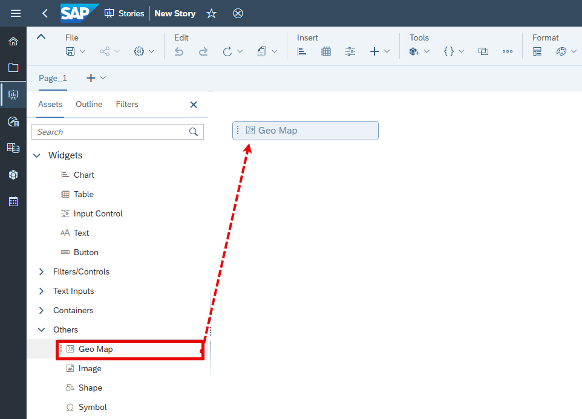
  
5. Resize the map so that it uses the complete canvas. You can accomplish this by opening the ***More*** menu (***...***) and selecting ***Fullscreen***.

    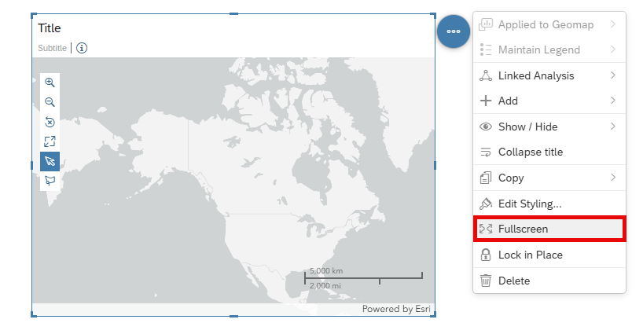

6. In the Builder panel on the right-hand side, select the option ***Add Layer*** for the Content Layer option.

    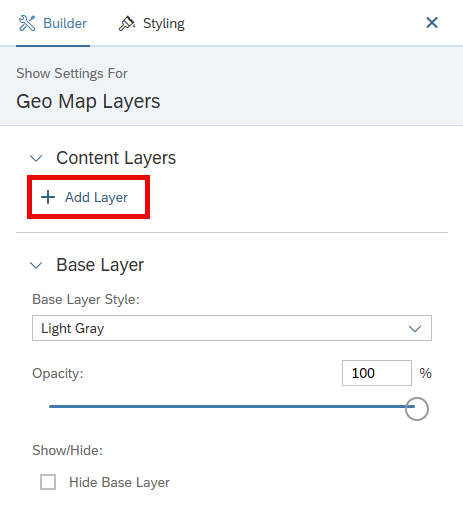 

7. Click on the model icon to choose your data model.

    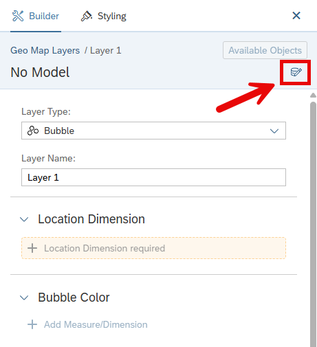

8. Click within the search field and choose ***Select other model*** option.

    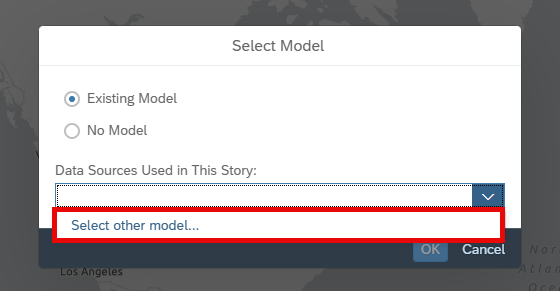

9.  To select the model that you want to reference in your story:

      - Select `Datasphere` as the connection on the left panel.
      - Select your space, e.g., `GE123456`, and the folder `TECHED2025-DA264`.
      - For our first example, select your `Sales - Analytic Model`.
    
        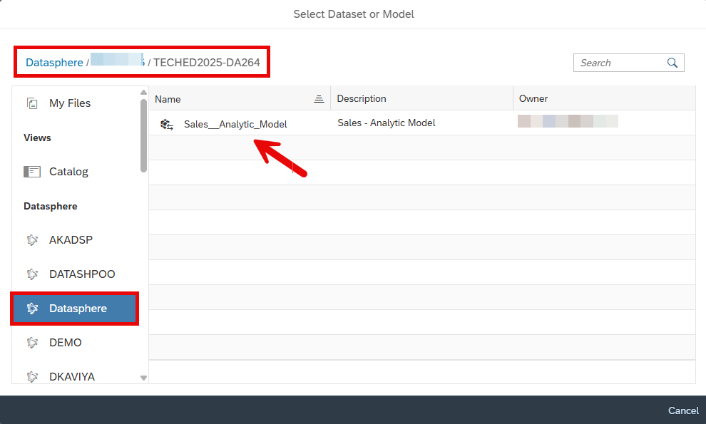

10. In the Builder panel, click on ***Location Dimension Required*** for the ***Location Dimension*** area.

11. Select the option ***Store Location***. This is the store location dimension we created previously based on the
longitude and latitude values for the store dimension.

    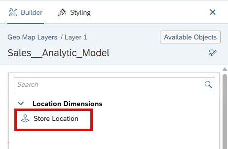 

12. Click on ***Add Measure*** for the Bubble Size.

13. Select measure ***Revenue***.

    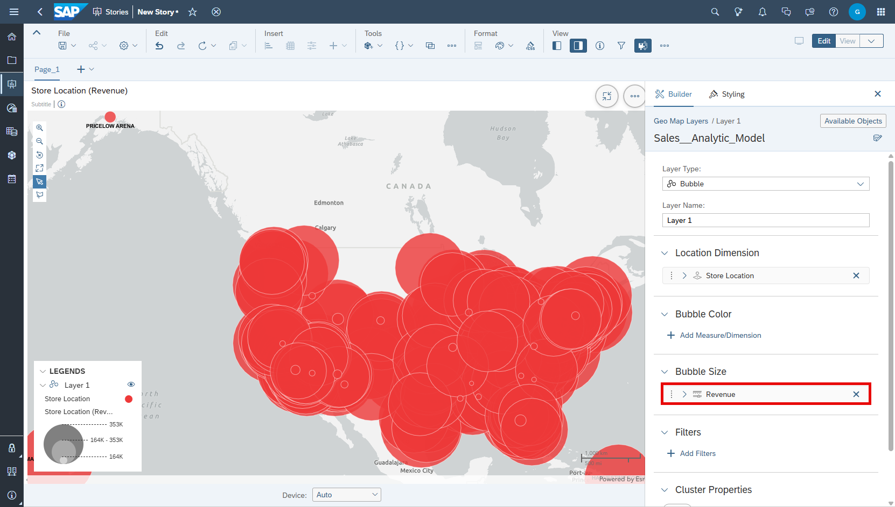 

14. Click ***Add Measure / Dimension*** for the Bubble Color

15. Select measure ***Profit***.

16. Now open the details for the measure ***Profit*** as part of the Bubble Color.

17. Open the list of color ***Palette***.

    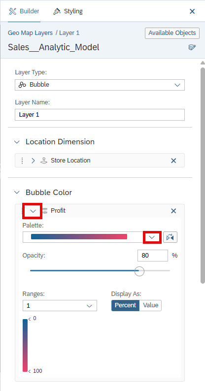 

18. Select the second entry from the ***continuous*** category (red to green).

    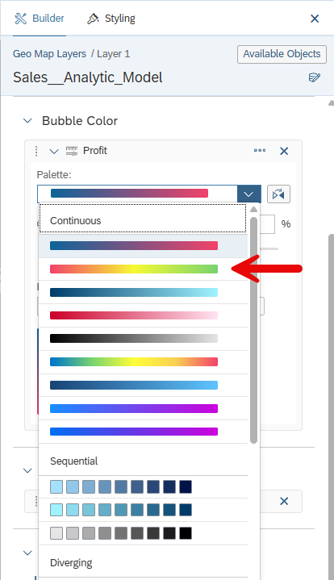 

19. Now open the details for the ***Bubble Size*** definition (Revenue).

20. Set the size to `35%`.

    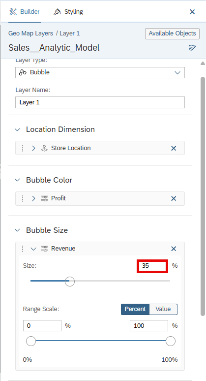 

21. Click ***Done*** to save your Layer.

22. Your map should look like this.

    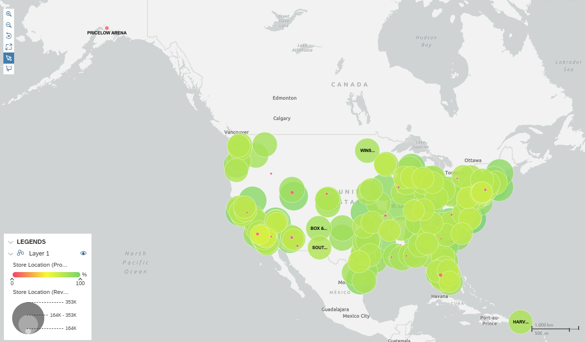 

23. In the File menu, select ***Save*** to save your story.

24. Select the folder that matches your assigned user number, like `GE123456`.

25. Enter a name and description, like ***Geographic Revenue Distribution***.

26. Click ***Save***.

    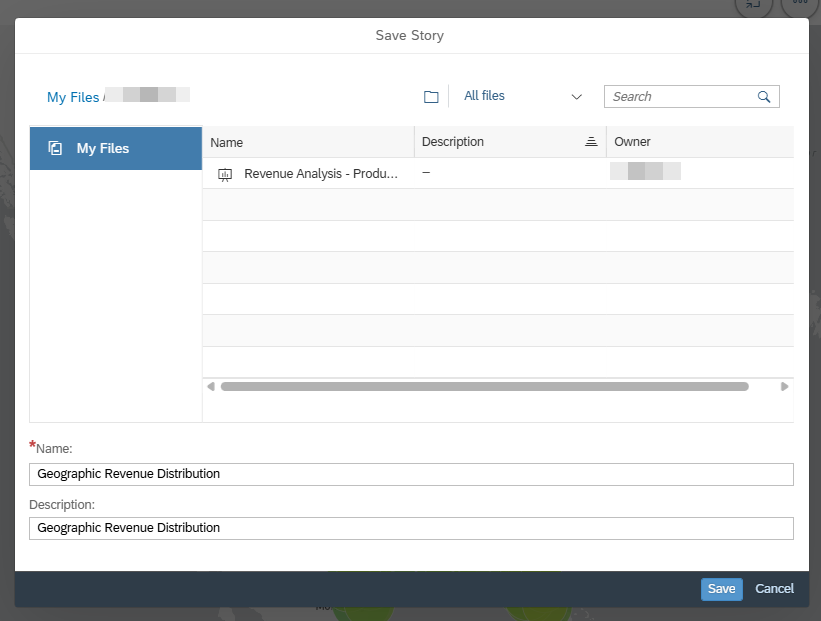

## Summary

You've now created your second story in SAP Analytics Cloud using the preconfigured connection to your data models in SAP Datasphere.

You can continue with one of the _optional_ exercises:
- [Exercise 20: Identify Top-Performing Sales Managers with Just Ask](../ex20/README.md)
- [Exercise 21: Create Row-Level Permissions based on External Hierarchy)](../ex21/README.md)
- [Exercise 22: Explore the Analytic Model](../ex22/README.md)
- [Exercise 23: Create a Transformation Flow)](../ex23/README.md)
